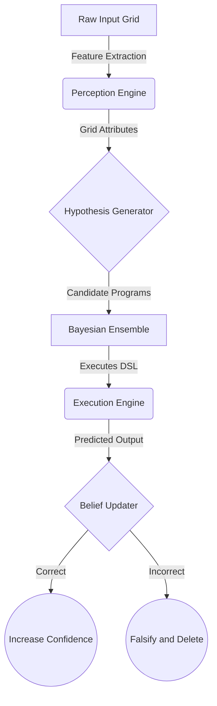

<div align="center">
  
  
  
  <h1>ARC-Challenge: Active Hypothesis Testing Agent</h1>
</div>

Welcome to the **ARC-Challenge** repository! This project implements a novel **Active Hypothesis Testing framework** aimed at solving the incredibly difficult Abstraction and Reasoning Corpus (ARC-AGI-2 and ARC-AGI-3) challenges.

---

## 🚀 Key Achievements
- **End-to-End Pipeline**: Fully integrated perception, executor, and hypothesis-generation logic running entirely offline.
- **Strict Mathematical Falsification**: Accurate implementation of Bayesian Belief Updating to prune billions of possible combinations instantly.
- **Zero-Shot Baseline Verified**: Solves `2.9%` of the full dataset locally using pure deterministic heuristics and combinatorics (prior to massive external LLM hooking).

## 🧠 Technical Details

This agent runs an **Active Hypothesis Testing Loop** containing 5 distinct modules:

1. **Perception Engine**: Dynamically calculates bounds, isolates 4-connected subcomponents, deduces true background colors, and generates `grid_attributes()`.
2. **Hypothesis Generator**: Uses combinatorial heuristics to dynamically generate rule chains such as `rotate_90_cw | map_colors(1:2)`.
3. **Execution Engine (DSL)**: Capable of 15+ complex geometric and topological operations (e.g. `fill_holes`, `tile_2x2`, `gravity_down`, `recolor_largest`).
4. **Bayesian Belief Updater**: Maintains an ensemble of hypotheses. If an execution matches true outputs, confidence multiplies by `1.5x`. If it predicts incorrectly, it is rigorously falsified.
5. **Interactive Agent (ARC-AGI-3)**: Implements a 30-step action engine using an "Explore-First" multi-armed bandit approach.

## 🗺️ System Architecture



## 🛠️ Usage

This repository is built perfectly for Google Colab or Kaggle execution.

```python
import sys
sys.path.append('./ARC-Challenge')

from src.evaluate import evaluate_on_training
from pathlib import Path

DATA_DIR = Path('./ARC/data/training')
results = evaluate_on_training(DATA_DIR, n_tasks=400)
```
